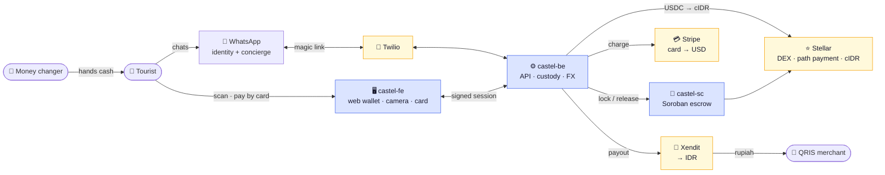
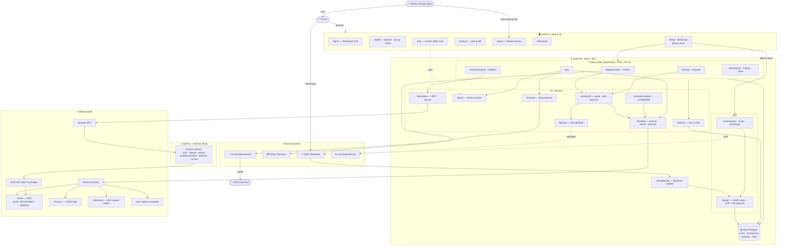

# Castel — Architecture

How the three repos fit together, and what each one touches. Two views: a high-level map,
then the full breakdown.

- **[castel-fe](https://github.com/CastelPay/castel-fe)** — Next.js web wallet (camera + card only)
- **[castel-be](https://github.com/CastelPay/castel-be)** — Hono/Bun API, custody, FX, settlement
- **[castel-sc](https://github.com/CastelPay/castel-sc)** — Soroban escrow contract (Rust)

---

## Simple view

**The one-line read:** WhatsApp is the account, the web app is just a camera and a card
form, the backend holds the keys and moves the money, Stellar is the FX rail, and the
Soroban contract escrows the cash-out. Merchants and agents always touch **rupiah**, never
crypto.

---

## Detailed view

### What each layer is responsible for

| Layer | Owns | Does **not** |
|---|---|---|
| **castel-fe** | Camera scan, card hand-off, PIN entry, showing rupiah | Hold keys, sign transactions, know a phone number is real |
| **castel-be** | Custody (Stellar keys), auth, FX, QRIS decode, settlement, limits | Store card numbers (Stripe does), run the AMM (the DEX does) |
| **castel-sc** | Trustless cash-out escrow (hashlock, timelock, fee split) | Anything in the deposit/pay path — that is all Stellar Classic |

### Why the split

- **Keys live only in the backend.** The tourist never holds a seed phrase; the web app
  never sees a secret. The phone number is identity, a signed token is authority.
- **The card form and the camera are the only reasons the web app exists** — a chat can do
  neither. Everything else is a WhatsApp message.
- **Soroban is used once.** Deposit and pay are Stellar Classic (path payments); only the
  cash-out needs custom on-chain logic, so only the cash-out is a contract.
